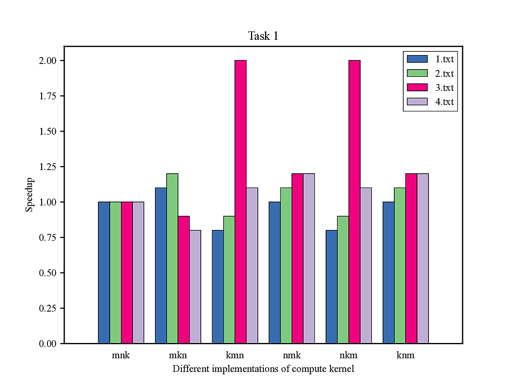

# Matrix Multiplication: A CPU's Perspective

## Introduction

Matrix multiplication has always been a central task in many applications, from recently widely-recognized neural networks to more traditional scientific computing.

Matrix multiplication has a naive 3-level nested `for` loop implementation, namely

```C
for (int i = 0; i != m; i++) {
  for (int j = 0; j != n; j++) {
    for (int l = 0; l != k; l++) {
      Z[i][j] += X[i][l] * Y[l][j];
    }
  }
}
```

Even though we have more advanced algorithms that achieve lower complexity than this simple form, we can already achieve a 5X to 10X speedup with only simple code transforms. This is because we are running on a real-world CPU rather than an ideal Turing Machine, namely a real-world CPU with caches and advanced instructions like SIMD.

In this lab, we will explore the large design space offered by a real-world CPU and try to get a sense of various system-level optimizations.


## Background

### Pointer

Pointer is a powerful yet dangerous feature of C. Many may find pointer confusing and hard to understand. But from the assembly's perspective, the pointer is very natural.

```C
int a = 0;
int *b = &a;
```

For example, in the above code snippet, we have defined `a` as an `int` and `b` as a pointer to `int`. If we want to add 1 to `a`, how can we do so in assembly?

For `a += 1`, we may have the following assembly generated.

```asm
ld x1, #address of a
addi x1, x1, 1
st x1, #address of a
```

But for `*b += 1`, we may have this form

```asm
ld x1, #address of b
ld x2, x1 ; the content of x1 is now the address of a
addi x2, x2, 1
st x2, x1
```

In the second assembly snippet, the value of register `x1` is the address of `a` and the value of `b`, then `ld x2, x1` dereferences the pointer (namely `*b`) and load the value of `a` to register `x2`. We can see that instead of hard-encoding the address of `a` in assembly code, we can use register `x1` to store the address of `a`, which is far more flexible.

### Array

Subscripting an array is just syntactic sugar for dereferencing a pointer, namely you can always interpret `a[i]` as `*(a+i)`.

A side note though, an array is not always equivalent to a pointer (e.g. the `sizeof` operator). For further details, you can refer to Chapters 9 and 10 of _Expert C Programming: Deep C Secrets_.

Now let's talk about pointer arithmetic. When you add an integer to a pointer, what happens? For example, if we have an `int *p` where the address stored in `p` is `0x800`, then what's the result of `p + 1`? You may answer `0x801`, which can be true, but most of the time it is false. This depends on the definition of `int`. If `sizeof(int) == 1`, namely int takes one byte, then the result is `0x801`. But most of the time `sizeof(int)` equals 4 or 8, so `p + 1` should be `0x804` or `0x808`.

Then let's talk about multi-dimensional arrays. Suppose we have an `int a[7][8]`, by the syntactic sugar introduced above, `a[4][6]` is equivalent to `*(*(a+4)+6)`, and by the pointer arithmetic above, it is equivalent to loading the content at address `0x800 + 4 * sizeof(int[8]) + 6 * sizeof(int)`.

### Cacheline

For simplicity of implementation and exploitation of space locality, cache is usually implemented using cachelines, namely all contents around one address are cached instead of just caching one content for one access to one address.

For example, suppose your cacheline is 8B, then if you access `0x800`, `0x806` is also cached. This is especially friendly to arrays. Namely if you have accessed `a[i]`, `a[i+1]` is highly possible to be also cached and the load instruction to `a[i+1]` can be extremely fast.

For multi-dimensional array, if you have accessed `a[i][j]`, then access to `a[i][j+1]` is highly possible to be fast, but access to `a[i+1][j]` can be slow because it is not cached (you can calculate the address according to the `*(*(a+i+1)+j)` syntactic sugar above).

### Your RPi

According to the datasheet, RPi 4 has 32KB L1 Cache for each core and 1MB L2 Cache. By using a [memory system prober](https://github.com/gaomy3832/mem_sys_probe), we can find that the cacheline size is 64B for both L1 and L2 and the L1 cache is 4-way set associative. We will explain this prober in TA session.

## A large design space

There are many optimizations that can be applied to the naive implementation. They form a large design space altogether.

### Loop permutation

In the naive implementation above, we first loop over `k` (i.e., the innermost loop level), then `n`, then `m`. We may use `mnk` to denote this pattern.

According to the background, in the innermost loop of `k` (iterating `l`), after `Y[l][j]` is accessed, `Y[l+1][j]` is unlikely cached and its access would be slow. How about changing the loop order and looping over `n` (namely increment `j`) first? This is more cache-friendly for `Y`. But now we have to access different `Z[i][j]` in the innermost loop instead of reusing the same element.

This is one example of loop permutation, i.e., we transform from `mnk` to `mkn`. But we do not know whether the performance would be better or not; it depends on the matrix size, the matrix dimension, the cacheline size, the replacement policy, and more factors. The performance can hardly be analyzed precisely. The best way to evaluate each permutation is to run experiments.

### Transpose, i.e., array format

In the naive implementation, we can find that the access patterns to `X` and `Y` are different: `X` loops over its row first while `Y` loops over its column first. This is not cache friendly.

To resolve this, we can transpose `Y`. Namely instead of `Y[l][j]`, we can use `YP[j][l]` (Y Prime), which is more cache friendly if you loop over `k` first.

Note, doing a transpose has a cost. When you are loading the matrix, you have to manually transpose the input; also, when you are doing consecutive matrix multiplications (e.g., you have calculated `Z` and want to use `ZP` as the new `YP` for the next matrix multiplication), you also have to manually transpose it. 

In this lab, we have provided a `load` function for you to load the matrix into `YP` without counting them in the final computation time. But in later labs, you have to do consecutive matrix multiplication. So you should give a thought on how to choose between these array formats.

### Blocking

```C
for (int l = 0; l != k; l++)
```

Suppose you loop over `k` first but `k` is very large, e.g. 1M. Then you may have poor performance due to loss of locality.

A technique is to divide `k` into blocks. For example, with a hyper-parameter block size `b`, we can transform the above loop into the following form
```C
for (int lo = 0; lo != k / b; lo++)
  for (int li = 0; li != b; li++)
```

The key part is that we should do so on other axes like `m` and `n`, and then perform loop permutation on all these loops. Namely we should arrange the loops over one block into the inner part.
```C
for (int lo = 0; lo != k / b1; lo++)
  for (int io = 0; io != m / b2; io++)
    for (int li = 0; li != b1; li++)
      for (int ii = 0; ii != b2; ii++)
```

You should choose your hyper-parameters carefully based on your limited cache (refer to the background section)! You can also search on this hyper-parameter.

### Loop unrolling

```C
for (int l = 0; l != k; l++) {
  // payload
  Z[i][j] += X[i][l] * Y[l][j];
}
```

Each time after the execution of the payload, `l != k` is checked by the CPU, namely we have a conditional branch instruction. Loop unrolling by a factor of 2 in this example can eliminate 1 conditional jump instruction out of two loops.

```C
for (int l = 0; l != k; l += 2) {
  Z[i][j] += X[i][l] * Y[l][j];
  Z[i][j] += X[i][l + 1] * Y[l + 1][j];
}
```

However, branch instructions can be just a minor part of the whole execution. According to Amdahl's law, it may not be worth it to do so many manual loop unrolling.

### SIMD

Since loop unrolling is such a common pattern in many workloads, instead of using multiple instructions, modern CPUs have offered us SIMD instructions. This not only reduces the code size, but also gives the potential of massive speedup because there can be dedicated accelerator units inside the CPU.

ARM, i.e., the ISA of your RPi, has offered us such a SIMD feature called NEON. You may refer to [the manual of gcc](https://gcc.gnu.org/onlinedocs/gcc-4.6.4/gcc/ARM-NEON-Intrinsics.html) and [examples of ARM](https://developer.arm.com/documentation/102467/0100/Matrix-multiplication-example). 

## Tasks

### Code structure

In `src/` lies the code for the `main` program. This program mainly consists of three parts: `load`, `compute` and `compare`, and accepts four arguments: `filename`, `LOAD_SELECT`, `COMPUTE_SELECT` and `COMPARE_SELECT`. `filename` is the file for input matrices and the reference matrix; `LOAD_SELECT`, `COMPUTE_SELECT` and `COMPARE_SELECT` are enums defined in `common.h`, and different enumerators correspond to different function implementations.

The `load` part loads matrices `X`, `Y` and `Z` from the `filename` argument. According to the argument `LOAD_SELECT`, the function loads them into different formats. For example, if you have selected `LOAD_ROW_MAJOR` (defined in `common.h`), these matrices would be loaded into `X[M][K]`, `Y[K][N]` and `R[M][N]` respectively (defined in `common.c`). We have pre-defined some enumerators and variables (e.g. `X`, `X32`, `X16` and `Xp`) in `common.h` for you, and for some of these enumerators we have implemented the logic in `load.c` for your convenience. If you have the need on your `compute` kernel, you can implement your own `load`.

Then comes your part: `compute`. In this part, you should implement different `compute` (different kernels) according to the tasks described below. You should use the `X` and `Y` according to your selected load function, and store the result in `Z` (i.e. `Z[M][N]`, `ZP[N][M]` or `Zp`). We have provided some mandatory enumerators for you, but feel free to add your own enumerators as you are optimizing your kernel.

The `compare` part compares your computation result `Z` to the reference matrix `R`. We have defined some enumerators and compare logic for your convenience, but you can implement your own `compare` based on your `compute`.

Generally speaking, you can modify nearly everything as long as you keep the functionality, namely you can not modify the timer to make it malfunction, or you can not just copy `R` to `Z` in your own `load`, or include `arm_neon.h` when SIMD is not enabled.

Also, you should not use third party libraries or directly copy codes from them.

### Makefile

The entire workflow is supported by Makefile. You can just invoke `make target` to automate your compilation and execution.

Basically, the syntax for Makefile is

```Makefile
target: dependency
    command
    command
    command
```

And you can just invoke `make target` in your command line to execute all these commands as well as the commands to first satisfy the dependency.

You may read all the Makefiles we have provided to understand all the convenient helpers we have provided, and you can add your own targets. However, the compilation flags, e.g. `-O0` for all your submissions must not be changed.

### Generating data

```bash
# in utils/
make prep
make
# this may take a long time
# also, you should have at least 200M spare spaces for these data
make txt
```

Then you will find `test.txt` (example) and other txt files (test cases) in `bin/`

`test.txt` contains just 4x4 matrices and it is convenient for you to test your code.

```bash
# in src/
$ make mnk
Elapsed time (Human readable): 0s 0ms 101us 57ns
Elapsed time (Machine readable): 10157
```

You can run the above command and the `main` program will read `test.txt`.

In the meantime, if you want to run against our test cases, you can try

```bash
$ make mnk I=1
$ make mnk I=2
$ make mnk I=3
# and more...
```

### Task 1. Loop orders (2pt)

This task tries to show you the effect of loop permutation.

We have implemented `compute_row_major_mnk` in `compute.c` and defined a baseline target called `mnk` in `MakefileTasks` for you.

```bash
# in src/
# run the example
$ make mnk
# run test case 1
$ make mnk I=1
# run test case 2
$ make mnk I=2
```

After generating data, you can run the above command to try this code.

Then you should implement all other remaining permutations of `m`, `n` and `k` in `compute.c`.

After implementing one permutation, suppose it is `mkn`, you can try `make mkn` to test your code.

After implementing all these permutations, you should run the following command to collect the data and draw a speedup figure similar to the following one.

```bash
$ make task1 I=1
$ make task1 I=2
$ make task1 I=3
$ make task1 I=4
```



We have provided a plot script in `utils/plot.py`, to use this, you should `pip install easypyplot`. However, it is not required to use this script. If you are not familiar with python/pip, you can just use Excel.

You can try to analyze why there is such a difference across one data group and multiple data groups. This is not required in your report.

### Task 2. Common techniques (2pt+2pt)

This task consists of two parts.

The first part is similar to task 1. You should implement some techniques specified by us, collect the data and draw a speedup figure.

The techniques specified by us are `COMPUTE_Y_TRANSPOSE_MNK`, `COMPUTE_ROW_MAJOR_MNKKMN_B32` and `COMPUTE_ROW_MAJOR_MNK_LU2`. 

 * `COMPUTE_Y_TRANSPOSE_MNK`: Transpose `Y` when doing `load`. We have defined `t_mnk` target in `MakefileTasks` for you.
 * `COMPUTE_ROW_MAJOR_MNKKMN_B32`: Block the loop using a block size of 32. We have defined `mnkkmn_b32` target for you.
 * `COMPUTE_ROW_MAJOR_MNK_LU2`: Unroll the loop by a factor of 2 (namely using `l+=2`). We have defined `mnk_lu2` target for you.

In the speedup figure, you should compare these three cases to the baseline `mnk`.

You can try to analyze why there is such a difference across one data group and multiple data groups. This is not required in your report.

The second part is to optimize as much as you can. You can try different parameters when applying blocking/permutation/unrolling techniques. You should achieve a speedup of at least 5X against the baseline `mnk`. You must not use SIMD instructions in this task though.

A small side note. When you are trying different parameters, you can write multiple kernels instead of constantly modifying one kernel. You can modify `MakefileTasks` and add, for example, `mnkkmn_b4`, `mnkkmn_b16`, `mnkkmn_b64_lu4`. Then you can add them in the target `task2`, such that you can easily benchmark against one test using one command `make task2`.

You should submit your code and we will test against all these test cases (no extra/hidden test cases). You should choose your final implementation by changing the line `grade2: t_mnk` in `MakefileTasks` to your own implementation, e.g. `grade2: fancy_kernel_after_ten_hours_of_tuning`.

We will grade your submission with a linear scoring function. Namely, if you achieve `N`X speedup, you will get `min(max(N-1, 0), 4)/2` pts.

### Task 3. With SIMD (2pt+2pt)

This task consists of two parts.

The first part is similar to the second part. You can now use SIMD instructions. This time the required minimum speedup is 10X against the baseline `mnk`. You should change the line `grade3: simd` to your own implementation (You should not submit the one with `-O3`!). The grading policy is again linear.

The second part again is drawing a speedup figure.

[ARM said](https://developer.arm.com/documentation/den0013/d/Optimizing-Code-to-Run-on-ARM-Processors/Compiler-optimizations/GCC-optimization-options) that when you use `-O3`, the compiler would try to automatically optimize the code using SIMD. We will see how this affects performance.

You should draw a figure containing all four cases: `mnk`, `mnk` with `-O3`, your `simd` implementation, and your `simd` implementation with `-O3`. If the speedup is too large, you can use log scale in y-axis. This figure does not have the 10X requirement.

### Git (optional in this lab but highly recommended)

Instead of sending the code to your teammate again and again using IMs like Wechat and QQ, you should use a version control system. You can use `git` as the version control tool and <https://git.tsinghua.edu.cn> as your platform to collaborate with your teammate.

First you need to generate a SSH key on your raspberry pi

```bash
zhenghr@sysintro-example:~ $ ssh-keygen -t ed25519
Generating public/private ed25519 key pair.
Enter file in which to save the key (/home/zhenghr/.ssh/id_ed25519): 
Created directory '/home/zhenghr/.ssh'.
Enter passphrase (empty for no passphrase): 
Enter same passphrase again: 
Your identification has been saved in /home/zhenghr/.ssh/id_ed25519
Your public key has been saved in /home/zhenghr/.ssh/id_ed25519.pub
zhenghr@sysintro-example:~ $ cat ~/.ssh/id_ed25519.pub
ssh-ed25519 AAAAC3NzaC1lZDI1NTE5AAAAIKaPFMjRGCYxCMutkRdYBBn+O4mwJRgPaOdudcXe8XRm zhenghr@sysintro-example
``` 

Then you log into <https://git.tsinghua.edu.cn> and open <https://git.tsinghua.edu.cn/-/profile/keys>, then you paste the `ssh-ed25519` line above to add a key.

Next you should open <https://git.tsinghua.edu.cn/projects/new#blank_project> to create a PRIVATE project named `lab1` (not initialized with README). Then you will see a `Command line instructions` page. By now you should have copied the materials for this lab to your RPi. You should change your working directory to that folder. On your Raspberry Pi, first you need to finish your Git global setup, then follow the instructions in `Push an existing Git repository` section to push your local code to git.tsinghua. You may see the code in <https://git.tsinghua.edu.cn/zhenghr18/lab1> (change it to your username).

Then in <https://git.tsinghua.edu.cn/zhenghr18/lab1/-/project_members>, you should invite your teammate. After your teammate accepts the invitation on his/her email, you can now both see the contents in <https://git.tsinghua.edu.cn/zhenghr18/lab1>.

Now you can write your code. After a relatively complete modification (e.g. you have implemented one compute kernel). you can `git add`, then `git commit` to save your modification to a commitment; after `git push`, your local modifications are now synced to git.tsinghua. Your teammate would need to first do `git clone` (only once) to set up his/her local version, and then use `git pull` to see your newest code changes.

Detailed instructions about `git` will be introduced in Week 5 lecture about practical skills.

### Submission

You should submit your source code, and also a report containing the three figures required above, to <https://learn.tsinghua.edu.cn>. You should submit one file named `<student1_id>_<student2_id>.tar.gz` (e.g., `2021000000_2021000111.tar.gz`) with the following structure. You should strictly follow this structure as we will run automated evaluation.

```
2021000000_2021000111.tar.gz
├── report.pdf
└── src
    ├── common.c
    ├── common.h
    ├── compare.c
    ├── compare.h
    ├── compute.c
    ├── compute.h
    ├── load.c
    ├── load.h
    ├── main.c
    ├── Makefile
    └── MakefileTasks
```

You can produce such a submission using the following command.
```bash
# in the root directory of lab1
# suppose you have copied your report to this dir
$ tar czf ../2021000000_2021000111.tar.gz report.pdf src
```

And you can use the following command to inspect its contents.
```bash
$ tar tf ../2021000000_2021000111.tar.gz
report.pdf
src/
src/common.h
src/compare.c
src/common.c
src/compare.h
src/Makefile
src/main.c
src/compute.h
src/MakefileTasks
src/load.h
src/load.c
src/compute.c
```

When we are evaluating the speedup of your implementation, only the computation time of your kernel is recorded. Since for each test case there is a speedup, we will calculate the final speedup using geometric mean.
